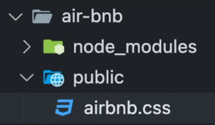
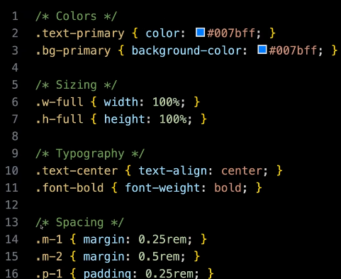
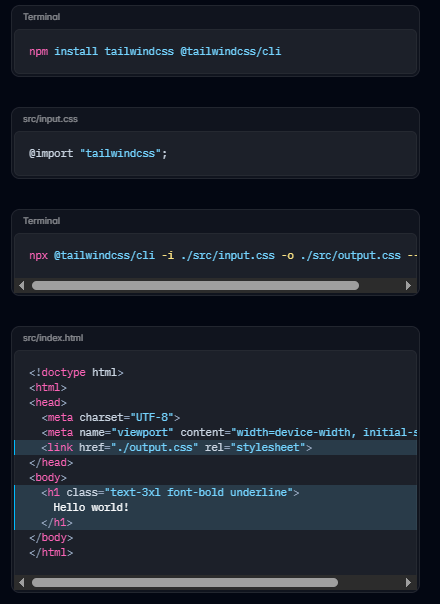

# Styling

## Serving Static Files:
Step 1: Create Public Directory.

Step 2: Place all files that should be public.



Step 3: **Grant access** to public folder by **adding middleware in app.js**:

```js
app.use(express.static(_path_of_static_files_));
```


## Tailwind CSS:

1. **Responsive**: **mobile-first** design, Built-in responsive utilities (e.g., sm, md).
2. **Utility-First**: Provides low-level utility classes for building custom designs.
3. **Highly Customizable**: Easily extendable through a config file.
4. **No Predefined Components**: Focuses on building custom components.
5. **Purge CSS**: Removes unused styles in production for smaller files.
6. **Fast Development**: Style elements directly in markup for speed.

## Utility Classes:

### Predefined Classes:


* You simply apply them to your HTML elements to get specific styles without writing custom CSS yourself.


## Including Tailwind CSS:

### Method 1 (CDN LINK):

- Add CDN link into markup file.

```html
<script src="https://cdn.jsdelivr.net/npm/@tailwindcss/browser@4"></script>
```

---

#### PROS:
* **Quick Setup**: No need to install Node.js, npm, or configure build tools like PostCSS — just add one line in your HTML file.

* **No Build Tools Needed**: You don’t need to configure Webpack, Vite, or any other bundler — it works out-of-the-box.

* **Always Up-to-Date** (if using latest): You can link to the latest version without worrying about manually updating.

#### CONS:
* **Large File Size**: The CDN version includes all Tailwind classes, leading to a very large CSS file (~3MB+ unminified). This slows down page load time.

* **No Purge**: You can’t remove unused CSS, which is a huge disadvantage for performance in production.

* **Limited Customization**: You cannot use tailwind.config.js to customize colors, fonts, spacing, breakpoints, etc.

* **No Plugin Support**: You can’t use official or third-party Tailwind plugins (like forms, typography, aspect-ratio) without a build step.

* **Not Recommended for Production**: Due to file size and lack of customization, Tailwind via CDN is not production-optimized.

* **Slower Initial Page Load**: Fetching a large CSS file from the CDN can make the first load slower, especially on poor networks.

---

### Method 2 (CLI Method):

Step 1 - (Install Tailwind CSS):

- Install this via npm.
```bash
npm install tailwindcss @tailwindcss/cli
```

Step 2 - Import Tailwind in your CSS:

- Add this to your **main CSS** file.
```css
@import "tailwindcss";
```

Step 3 - Create **output.css** file.

Step 4 - Start the Tailwind CLI build process:

- Run the CLI tool to scan your source files for classes and build your CSS.
```bash
npx @tailwindcss/cli -i _main.css_path_ -o _output.css_path_-watch
```

Step 5 - Start using Tailwind in your HTML:

- Add your compiled CSS file (**output.css**) to the <head> and start using Tailwind’s utility classes to style your content.


#### All Steps:
