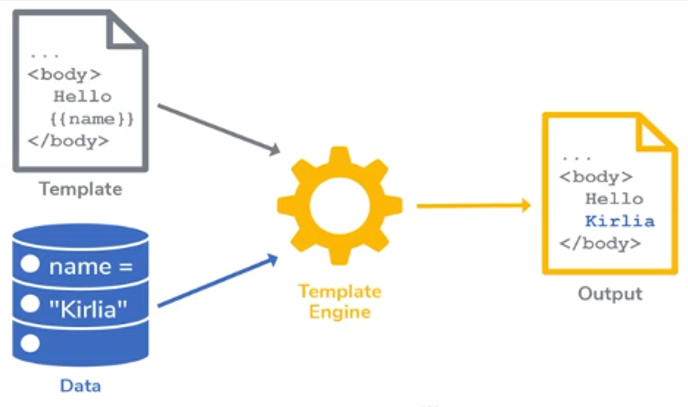

# Dynamic UI and EJS

## Need of Dynamic UI:

* **Personalized Content**: Tailors responses based on user profiles, preferences, or behaviours to enhance user experiance.

* **Dynamic Data Delivery**: Provides real-time information that updates with each request, such as lives scores or stock prices.

* **Security** and **Access Control**: Delivers different content based on user authentication and authorization levels.

* **Localization** and **Internationalization**: Adjusts responses to accommodate different languages, culture, or regional settings.

* **API Versatility**: Supports multiple client types (web, mobile, IoT) by providing appropriate data formats and structures.

## What is EJS?

* **Embedded JavaScript**.

* **Simple Syntax**: Uses **<% %>** for control flow and **<%= %>** for output.

* **Easy to Learn**: Familiar to those who know ***HTML*** and ***JavaScript***.

* **Template Reuse**: Supports ***partials*** for reusing code snippets.

* **Flexible Logic**: Allows full JavaScript expressions in templates.

