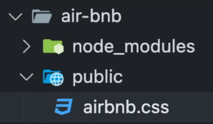

# Styling

## Serving Static Files:
Step 1: Create Public Directory.

Step 2: Place all files that should be public.



Step 3: **Grant access** to public folder by **adding middleware in app.js**:

```js
app.use(express.static(_path_of_static_files_));
```


## Tailwind CSS:

1. **Responsive**: **mobile-first** design, Built-in responsive utilities (e.g., sm, md).
2. **Utility-First**: Provides low-level utility classes for building custom designs.
3. **Highly Customizable**: Easily extendable through a config file.
4. **No Predefined Components**: Focuses on building custom components.
5. **Purge CSS**: Removes unused styles in production for smaller files.
6. **Fast Development**: Style elements directly in markup for speed.

## Utility Classes:

### Predefined Classes:
