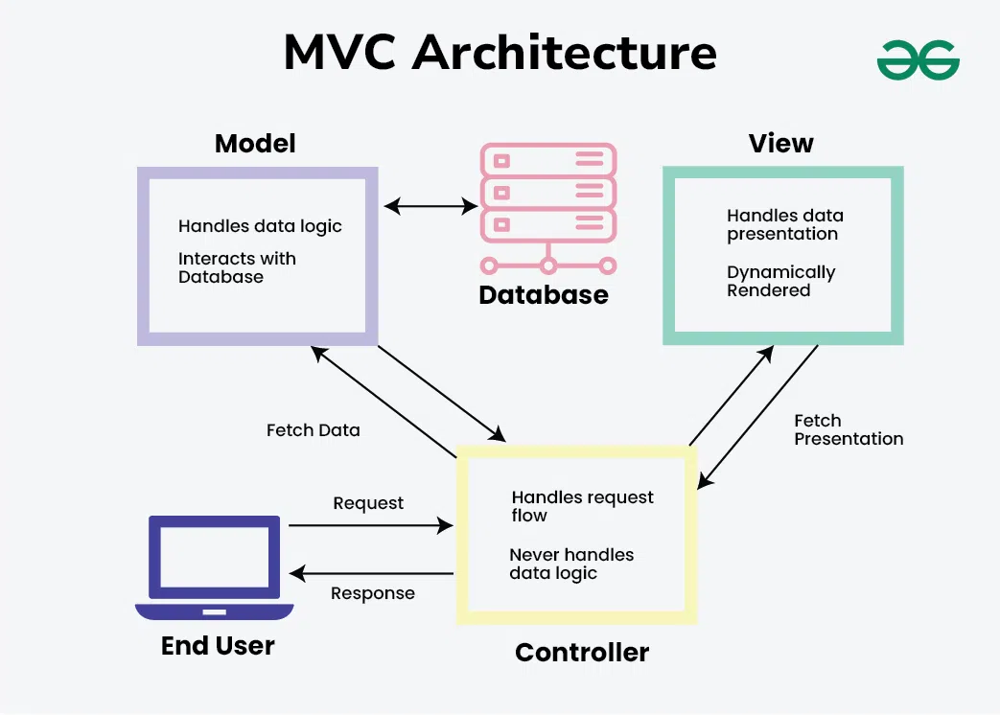
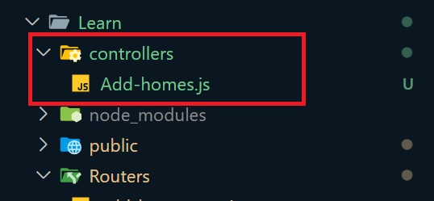
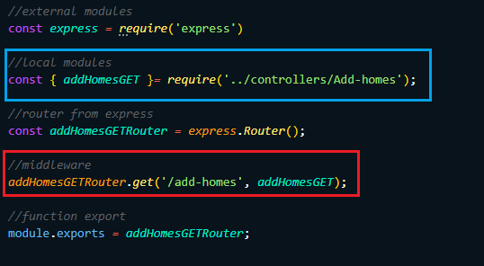
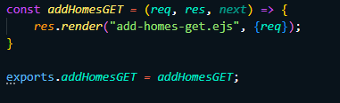

# Model View Controller (MVC)

* It is a design pattern used to separate application logic.

* Helps in organizing code better in large-scale applications.

## Components of MVC:

1. Model:
    * Manages data and business logic.
    * Interacts with the database (e.g., MongoDB, MySQL).
    * Example: User schema, data validation, CRUD operations.

2. View:
    * Handles the UI (User Interface).
    * Displays data to the user.
    * Can be made using templating engines like EJS, Pug, Handlebars.

3. Controller:
    * Acts as a bridge between Model and View.
    * Handles requests from users.
    * Calls the Model to fetch data and returns a View.
    (**Routes** are also part of controller)

## How MVC works in Express.js
* User sends request via browser.
* Controller receives the request and processes it.
* Model is called to access/update data.
* Controller gets the result and sends it to the View.
* View renders the result to the user.

## Adding First Controller:

* Making **controllers** directory in main project.  

#### EXAMPLE:
* We extract from **Routers/add-homes-get.js** middleware's function and putting into *controllers directory* with the name of **Add-homes.js**.

* Now we can put all the functions that related to Add-homes into **controllers/Add-homes.js**.

> Router/add-homes.get.js:  

> controllers/Add-homes.js:  

