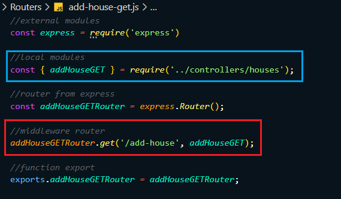
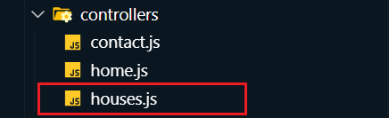

# Model View Controller (MVC)

* It is a design pattern used to separate application logic.

* Helps in organizing code better in large-scale applications.


## Components of MVC:

1. Model:
    * Manages data and business logic.
    * Interacts with the database (e.g., MongoDB, MySQL).
    * Example: User schema, data validation, CRUD operations.

2. View:
    * Handles the UI (User Interface).
    * Displays data to the user.
    * Can be made using templating engines like EJS, Pug, Handlebars.

3. Controller:
    * Acts as a bridge between Model and View.
    * Handles requests from users.
    * Calls the Model to fetch data and returns a View.
    (**Routes** are also part of controller)


## How MVC works in Express.js
* User sends request via browser.
* Controller receives the request and processes it.
* Model is called to access/update data.
* Controller gets the result and sends it to the View.
* View renders the result to the user.


## Adding First Controller:

* Making **controllers** directory in main project. <br/>


#### EXAMPLE:
* We extract from **Routers/add-house-get.js** middleware's function and putting into *controllers directory* with the name of **Add-house.js**.

* Now we can put all the functions that related to Add-house into **controllers/Add-house.js**.

> **Router/add-house-get.js:** <br/>


> **controllers/houses.js:** <br/>



## Nodemon.json:
* create nodemon.json and put this code:
```json
{
    "watch": ["."],
    "ext": "js, json, ejs",
    "ignore": ["node_modules/", "data/"],
    "exec": "node app.js"
}
```

* "**watch**": ["."]
    * Tells the watcher (likely nodemon) to *monitor all files in the current directory* (".") for changes.

* "**ext**": "js, json, ejs"
    * Specifies the *file extensions to watch*.
    * Here it’s .js, .json, and .ejs. If any of these change, the app will restart automatically.

* "**ignore**": ["node_modules/", "data/"]
    * Lists folders to *ignore when watching for changes*.
    * In your case:
        * node_modules/ → likely meant to be node_modules/ (you have a typo).
        * data/ → changes here will also be ignored.

* "**exec**": "node app.js"
    * Specifies the command to *execute* when a change is detected.
    * Runs node app.js to start the application.


## Prectice Question:
```
Question: Taking your website forward:
    1. Structure the views folder into "host" & "store" and move the respective views files there.
    2. Add more views to store like: "house-list", "house-details", favourite-list, reserve, booking. 
       And to host view: "edit-house", "host-house-list".
    3. Improve the "header with navigation to all pages".
    4. Register all the "new routes" and "add dummy views" there.
    5. Change "conrollers to store" and host setup.
    6. "Add Edit and Delete buttons" to the "host-house-list" view.
    7. Keep the logic for "Edit", "Delete", "Favourite" pending.
```