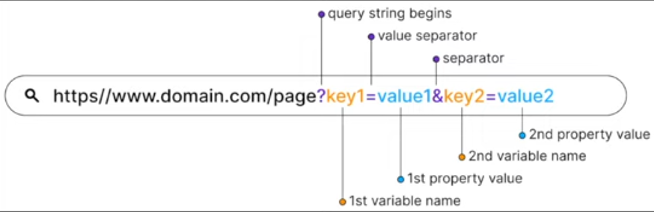
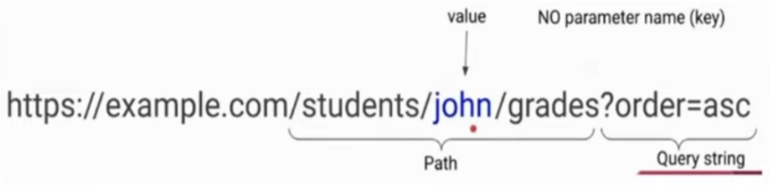

# Dynamic Path

## What are Dynamic Paths?**

* **Path parameters are variables**: embedded directly in the URL path to capture dynamic values, like ***/users/:userId*** where **:userId is replaced with a specific user ID**.

* **Query parameters**: are key-value pairs appended to the URL after a **?**, used to send additional data, like ***/search?query=nodejs*** where **query=nodejs** specifies the search term.

### Example:

### Prectice:

1. Add a **details button** in ** house-list** to go link path **/house/:house-id**
2. Add a **random id to each house** in the data file.
3. Add a **random id on house object** before saving in the house model.
4. Add a **route in the storeRouter** for /house/:house-id
5. Add a **method in storeController to get the house-id using req.params** and log it, before sending out a dummy response with house-id.

## Showing Real Hous Data:
1. Add a static findById method in Houses Model that takes a callback.
2. Use this findById method in the controller to load house details and log them.
3. Now change the controller:
    a. Redirect to /houses in case the house is not found, logging an error.
    b. Rendering the /house-details page with house data.
4. Create a house-details page to use the entire page to show all the data. 