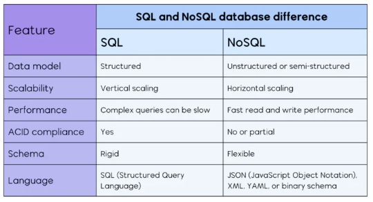

# Database

## What is a Database:
1. **Store Data**: Keep the **large amounts of data** in a **structured format**.
2. **Enable Data Management**: Allow for **adding**, **updating**, and **deleting** data easily.
3. **Favilitate Quick Access**: Provide **fast retrieval** of data **through queries**.
4. **Ensure Data Integrity**: Maintain **accuracy** and **consistency** of data over time.
5. **Support Multiple Users**: Handle **concurrent access by many users** simultaneously.
6. **Secure Data**: **Protect information** through **access controls** and **authentication**.

## SQL Databases:
* **Vertical Scalability**: Typically scaled by increasing the resource of a single server (scaling up).
* **Relationships**: Tables can have **multiple types of relationships**.
* **Relational Model**: Organize **data into tables** with ***rows*** and ***columns***.
* **Fixed Schema**: Require a ***predefined schema***, the *structure of the data must be known in advance*.

## SQL (Structured Query Language):
* **Relational Model Use of SQL**: Utilize SQL for querying and managing data, which is a *standardized* and *widely-used language*.
* **ACID Compliance**: Support transctions that are ***Atomic***, ***Consistent***, ***Isolated***, and ***Durable***.
* **Complex Queries**: Excel at handling complex queries and relationships between data.

## NoSQL Databases:
* **Flexible Schema**: Allow for ***dynamic schemas***, accommodating ***unstructured*** or ***semi-structured*** data ***without predefined structures***.
* **Duplicacy Over Relations**: Duplicates data across (**denormalization**) to enhanced performance and scalability, rather than relying on complex relationships and joins as in relational databases.
* **Horizontal Scalability**: Designed to scale out by adding more servers, handling large valumes of data efficiently.
* **Performance**: Optimized for high throghput and ***low latency***, ***suitable for real-time applications***.
* **Example**: ***MongoDB***

## SQL VS NoSQL

> Structure - SQL VS NoSQL  

> Comparison - SQL VS NoSQL  

## Setup of MySQL:

STEP 1: Download and Install - MySQL (choose based on your OS).:
Download: https://dev.mysql.com/downloads/

STEP 2: Download and Install - MySQL Workbench:
Download: https://dev.mysql.com/downloads/

👉 Installation is straightforward — just keep clicking Next.

## Creating a Schema in MySQL Workbench:
STEP 1: Open MySQL Workbench & connect to your server (use the password you set during installation).

STEP 2: In the Navigator panel, right-click Schemas → Create Schema…

STEP 3: Enter schema name (e.g., college_db).

STEP 4: Click Apply → Review SQL → Apply → Finish.

