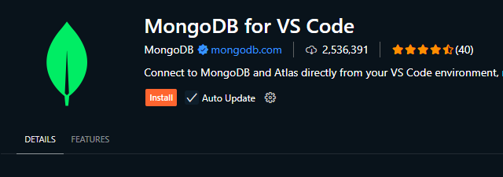
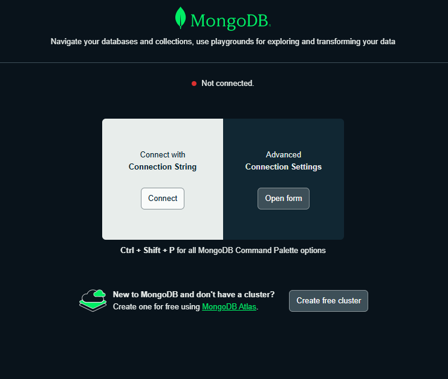

## MongoDB:
1. **MongoDB is the Product** and the company that builds it.
2. The **name** comes from the word ***Humongous***.
3. **NoSQL Document Database**: **Stores data** in Flexible, **JSON-like documents**.
4. **Dynamic Schema**: Allows **fields to vary across documents** **without predefined schemas**.
5. **High Performance**: Optimized for **fast read** and **write operations**.
6. **Scalability**: Supports **horizontal scaling through sharding**.
7. **High Availability**: Provides **replication with automatic faiover**.
8. **Rich Query Capabilities**: Offers powerful ***querying***, ***indexing***, and ***aggregation***.
9. **Geospatial and Text Search**: Includes support for ***location-based*** and ***full-text queries***.
10. **Cross-Platform Campatibility**: Works with various operating systems and programming languages.
11. **Easy Integration**: **Interates smoothly** with ***modern developments***.


## Setting up MongoDB:
**STEP 1**: Goto MongoDB Atlas - [MongoDB Atlas](https://www.mongodb.com/products/platform)

**STEP 2**: Login in MongoDB Website.

**STEP 3**: Choose Plan (Free) and Set Configurations => Create Deployment (Given in image 1).

**STEP 4**: Set username and password => Create Database User (Given in image 2).

**STEP 5**: Choose connection Method => Drivers (Given in image 3).

**STEP 6**: Connect:
1. Select driver and version - Choose Node.js and latest version (Given in image 4).
2. Run this command in terminal to install MongoDB: 
```bash
npm install mongodb
```
3. Copy **connection string** for connecting database to Website (Given in image 4).


## Installtion of MongoDB:
1. Install MongoDB with Node.js:
```bash
npm install mongodb
```
2. Create **databaseUtils.js** in utils directory.

3. Put this code in **databaseUtils.js**:

```js
const mongodb = require('mongodb');

const MongoClient = mongodb.MongoClient;

const MONGO_URL = "<MongoDB_Connection_STRING>";

module.exports = mongoConnect = (callback) => {
    MongoClient.connect(MONGO_URL)
    .then(client => {
        callback(client);
    })
    .catch(err => {
        console.log('Error while connect to mongoDB', err);
    });
}
```

4. Use MongoDB:
```js
MongoClient(client => {
    console.log(client);
    app.listen(PORT, () => {
        console.log(`Your server is running on http://localhost:${PORT}`);
    });
});
```


## Installtion of MongoDB Compass:
1. Download and Install MongoDB Compass as per your Operating System.
[MongoDB Compass](https://www.mongodb.com/try/download/compass)

2. Create Connection.

3. Paste **Connection String** and set name for connection and **Save and Connect**.

Now, You can access your MongoDB Database through MongoDB Compass.


## MongoDB for VS Code (Extension):


1. Install **MongoDB For VS CODE** Extension from VS code extension store.

2. Click on Add Connection.<br/>

3. Connect with Connection String:<br/>


Now, You can access your MongoDB Database through MongoDB For VS Code Extension.


## Adding MongoDB to Favourite:
1. **Remove all the file handling** related code from **Favourite model**

2. Delete the data folder.

3. Change the following methods in Favourite model to use mongo:
    * fetchAll
    * Change addToFavourites to save method.
    * deleteById

4. Change the usages of Favourite model in storeController to use the promise syntax.
    * getFavourites
    * postAddFavourites
    * postRemoveFavourites