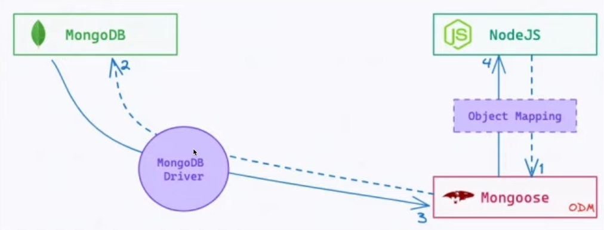

# Mongoose

## What is Mongoose?



1. Mongoose is an **Object Data Modeling *(ODM)*** library for MongoDB and Node.js
2. Provides a **schema-based solution** to model application data.
3. Simplifies **data validation** and **type casting** in Node.js applications.
4. Enables **easy interactions** with MongoDB through intuitive methods.
5. **Supports middleware** for pre and post-processing of data.
6. Helps to **manage relationships between data with built-in functions**.


## Setting up Mongoose

### 1. Install Mongoose package
```bash
npm install mongoose
```

### 2. Mongoose connect:
```js
//import mongoose
const { default: mongoose } = require('mongoose');

//
mongoose.connect('<db_connect_string/<db_name>>')
```

### 3. Mongoose Schema:
```js
const schema = mongoose.Schema({
    key: "value",
    key2: "value2",
    ...
});
```

Example:
```js
const schema = mongoose.Schema({
    houseName: {type: String, required: true},
    price: {type: Number, required: true},
    location: {type: String, required: true},
    imageURL: String,
    description: String,
});
```

### 4. Exports as model:
```js
module.exports = mongoose.model("<model_name>", "<schema>");
```

Example:
```js
module.exports = mongoose.model("House", schema);
```

## Mongoose Default functions:

1. find()
2. findById()
3. findByIdAndDelete()
4. findOneAndDelete()