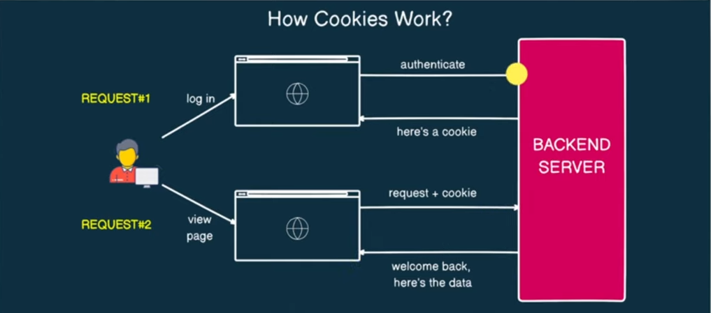

# Cookies and Session

## What are cookies?

* **Cookies** are small pieces of ***data stored in user's browser*** by the server.

* They help **websites remember user information** and **preferences** between *** page loads*** or ***visits***.

* Cookies can **manage user sessions** and **store data for personalized experiences**.

