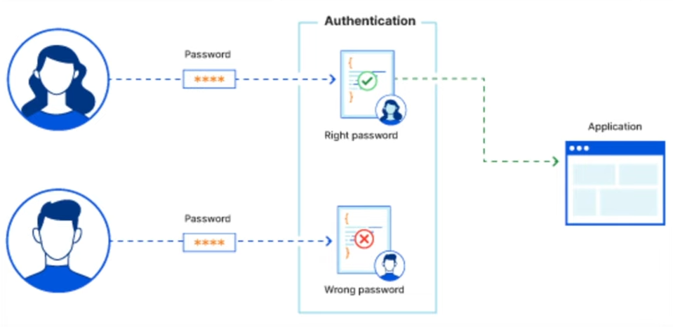
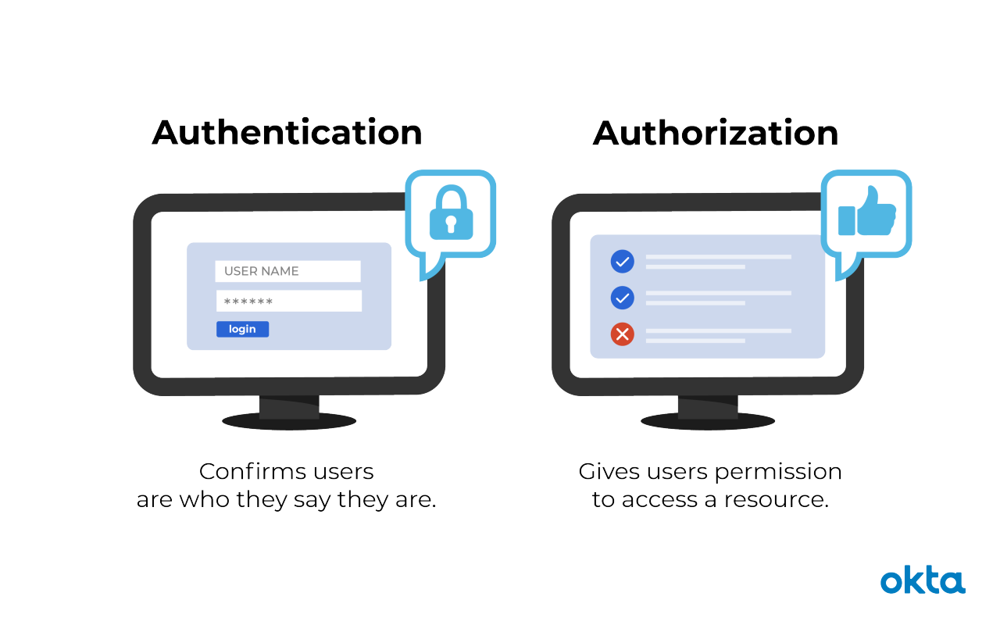

# Authentication and Authorization:

## What is Authentication?



1. Authentication is the **process of verifying the identity** of a **user** or **system accessing an application**.

2. It ensures that **only authorized users can access protected resources** and **features**.

3. Authentication is **crucial for security**, **protecting data**, and **providing personalized experiences** in web applications.


## What is Authorization?

1. Authorization is the **process of determining what actions a user is permitted to perform** within an application.

2. It ensures that **users can access only the resources** and **funcationalities they have permission for**.

3. Authorization **enhances security by restricting access to sensitive data** and **operation**, complementing the authentication process.


## Authentication VS Authorization



---

| Aspect          | Authentication                                      | Authorization                                           |
|-----------------|-----------------------------------------------------|---------------------------------------------------------|
| **Definition**  | Verifies the identity of a user or system           | Determines what resources a user can access             |
| **Purpose**     | Ensures users are who they claim to be              | Grants or denies permissions to resources and actions   |
| **Process**     | Validates credentials like usernames and passwords  | Checks user privileges and access levels                |
| **Occurs When** | At the start of a session or when accessing secured areas | After authentication, during resource access     |
| **User Interaction** | Requires user input (e.g., logging in)        | Usually transparent unless access is denied             |
| **Managed By**  | Handled by both frontend and backend systems        | Mainly enforced by backend servers                      |
| **Example**     | User logs into an account with a password           | User accesses settings page only if they have rights    |


## Signup UI (Project):

1. Define a **signup button in navigation bar** along with sign-in. It should point to a link **/signup**.

2. Define a **auth/signup.ejs** file that has the following fields and submits **POST request to /signup**:
    a. **firstName** and **lastName**,
    b. **email**,
    c. **password** and **confirmPassword**,
    d. **userType** with possible values "***guest***" and "***host***",
    e. **Terms and conditions** checkbox.

3. Define **routes in authRouter** and **behaviour in authController**.

4. **Fix the UI of the app** to look pretty.


## Express Validator

### Overview:

* Express-validator is a **set of express.js middlewares** that wraps the extensive **collection of validators** and **sanitizers** ***offered by validator.js***

* It allows you to combine them in many ways so that you can **validate and sanitize your express requests**, and **offers tools** to d**etermine if the request is valid or not**, **which data was matched according to your validators**, and so on.


## Using Express Validator (for Project):

1. Add **handling for POST /signup** in **auth controller** and **router**.

2. **Install Express Validator**:
```bash
npm install express-validator
```

3. Use the **email** and **password validations** in the **post handler**.

4. Change the **signup.ejs** to **show the error**. And **accepts the old values**.


## Adding User Model:

1. Define a new **User Model** with following fields:
    * **firstName** and **lastName** (required),
    * **email** (required, unique)
    * **password** (required)
    * **userType** (possible values - "*guest*", "*post*")

2. In the **POST signup** handler, **create a new user** with the fields from request and redirect to **/login** after the user created.