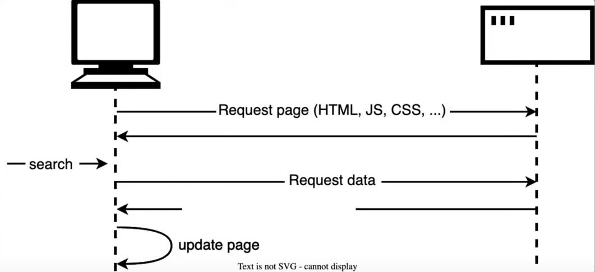

## What are Async Requests?

* **Async** network request **enables web pages to communicate with servers without reloading**

* The **client sends JSON** requests to the **server asynchronously** *in single-page apps*.

* The **server processes the request** and **returns a JSON response**.

* The **page updates itself dynamically** ***using the received data***.

