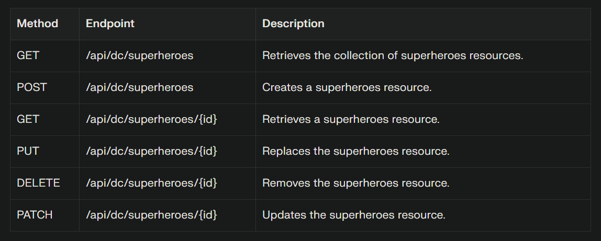

## What are Async Requests?

* **Async** network request **enables web pages to communicate with servers without reloading**

* The **client sends JSON** requests to the **server asynchronously** *in single-page apps*.

* The **server processes the request** and **returns a JSON response**.

* The **page updates itself dynamically** ***using the received data***.

## What are REST APIs?

**REST API** => ***Representational State Transfer Application Programming Interface***

* **REST APIs** enables **communication between clients** and **servers** *using HTTP*.

* They are mainly **identified by a URL**.

* They use standard **HTTP** methods like **GET**, **POST**, **PUT**, and **DELETE**.

* REST APIs are **stateless**.

* REST APIs **allows clients to access and manipulate web resources**.

## Decoupling Frontend & Backend:

* **Separating front-end** and **back-end** allows *independent development and scaling*.

* **REST APIs** serve as a **communication layer between them**.

* **Front-end interacts with back-end** *through standardized **RESTful calls***.

* **Decoupling enhances flexibility** and **simplifies maintenance**.

* **REST APIs enable front-end updates without altering back-end code**.

## Routes & HTTP Methods?

* **REST API routes** define the **endpoints** (URLs) where **resources can be accessed by clients**.

* **GET**: **Retrieves data from the server** at the specified route.

* **POST**: **Sends new data to the server** to **create a resources**.

* **PUT**: **Updates** or **replaces** an **existing resource** at a given route.

* **DELETE**: **Removes a resources from the server** at the specified route.

* **PATCH**: Partially **updates an existing resources with new data**.

## REST Core Concepts:

* **Statelessness**: Each **request contains all necessary information**. The **server maintains no client session**.

* **Uniform Interface**: Standardized communication using HTTP methods like **GET**, **POST**, **PUT**, **DELETE**.

* **Client-Server Separation**: **Independent development** of ***front-end*** and ***back-end*** components.

* **Cacheability**: Responses indicate if they can be **cached to improve performance**.

* **Layered System**: Architecture allows for **multiple layers between client and server**.

* **Code on Demand (*Optional*)**: Server can **extend client functionality by sending executable code**.