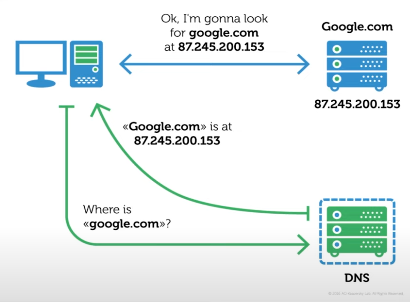
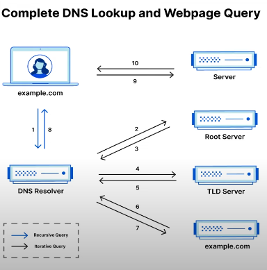
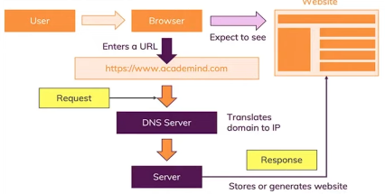
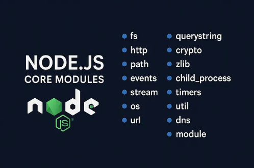

## DNS:
1. DNS Stands for **Domain Name Service**.
    example: User type a domain (e.g., www.example.com) into the browser.
2. **DNS Query**: The browser sends a DNS query to resolve the domain into an IP address.
3. **DNS Server**: Provides the correct **IP address for the domain**.
4. **Browser Connects**: The browser uses the IP to connect to the web server and loads the website.




## How actual DNS works?
1. **Root DNS**: Acts as the starting point for DNS resolution. It directs queries to the correct TLD server (e.g., **.com**, **.org**).
2. **TLD (Top-Level-Domain) DNS**: Handles queries for specific top-level domains (e.g., **.com**, **.net**) and directs them to the authoritative DNS server (e.g., **Verisign for .com, PIR for .org**).
3. **Authoritative DNS**: Contains the actual IP address of the domain and answers DNS queries with this information. (e.g., Cloudflare, Google DNS).




## How web works?
1. **Client Request Initiation**: The client (browser) initiates a network call by entering a URL.
2. **DNS Resolution**: The browser contacts a DNS server to get the IP address of the domain.
3. **TCP Connection**: The browser **establishes a TCP connection** with the server's IP address.
4. **HTTP Request**: The browser sends an HTTP request to the server.
5. **Server Processing**: The server processes the request and prepares a response.
6. **HTTP Response**: The **server sends** an **HTTP response back to the client**.
7. **Network Transmission**: The **response travels back to the client** over the network.
8. **Client Receives Response**: The browser receives and interprets the response.
9. **Rendering**: The browser renders the content of the response and displays it to the user.




## What are Protocols?
HTTP (Hyper Text Transfer Protocol):
* **Facilitates communication between a web browser** and **server** to **transfer web pages**.
* Sends data in **plain text** (**no encryption**).
* Used for basic website **browsing without security**.

HTTPS (Hyper Text Transfer Protocol Secure):
* **Secure version of HTTP**, **encrypts data** for secure communication.
* Uses **SSL/TLS** to encrypt data.
* Used in **online banking e-commerce**.

TCP (Transmission Control Protocol):
* **Ensures reliable**, **ordered**, and **error-checked** **data delivery over the internet**.
* Establishes a **connection before data is transfer**.


## Node Core Modules:
* **Built-in**: Core modules are included with Node.js installation.
* **No Installation Needed**: Directly available for use without npm installation.
* **Performance**: Highly optimized for performace.



1. **fs** (File System): **Handles file operations** and makes HTTP requests.
2. **http** (Hyper Text Transfer Protocol): Creates HTTP servers and makes HTTP requests.
3. **https** (Hyper Text Transfer Protocol Secure): Launch a SSL server.
4. **path**: Provides utilities for handling and transforming file.
5. **path.os**: Provides operating system-related utility methods and properties.
6. **events**: Handles events and event-driven programming.
7. **crypto**: Provides cryptographic functionalities like hashing and encryption.
8. **url**: Parses and formates UTL strings.


## Required Keyword:
1. **Purpose**: **Imports modules** in Node JS.
2. **Caching**: Modules are **cached after the first required call**.
3. **.js** is **added autumatically** and  **not needed** to add at the end of module name.
    (e.g., require(**fs.js**) as require(**fs**)).
4. **Path Resolution**: Node.js **searches for modules** in **core**, **node_modules**, and **file paths**.

### Syntax:
```js
const moduleName = require('module');

//Load the built-in http module
const http = require('http');

//Load the third party express module
const express = require('express');

//Load the custom module
const myModule = require('./myModule');
```


## Creating first Node.js Server:
```js
const http = require('http');
```