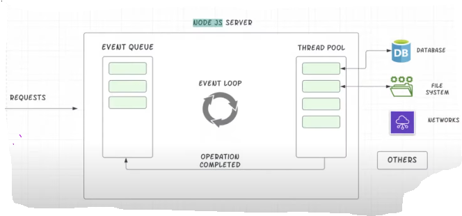

# Request and Response in Node.js

## Node.js Life Cycle and Event Loop:



> 🔁 YouTube video for better understanding:
[Watch Video](https://youtu.be/9HYAaXwS7I4?list=PL78RhpUUKSwfeSOOwfE9x6l5jTjn5LbY3&t=101)

# Node.js Event Loop (Simplified)

This is how the Node.js Event Loop works based on the diagram:

1. **Requests Arrive**  
   Incoming requests are received by the Node.js server.

2. **Event Queue**  
   Requests are placed into the **Event Queue**.

3. **Event Loop**  
   The Event Loop constantly checks the Event Queue and processes each task one by one.

4. **Thread Pool (libuv)**  
   Time-consuming tasks (like file operations, DB queries, etc.) are passed to a Thread Pool.

5. **External Operations**  
   The Thread Pool handles communication with:
   - **Databases**
   - **File Systems**
   - **Networks**
   - **Others**

6. **Operation Completed**  
   Once the task is completed, the result is passed back to the Event Loop.

7. **Send Response**  
   The Event Loop sends the final response to the client.

> 🔁 This loop continues, allowing Node.js to handle multiple operations asynchronously and efficiently.


## How to Exit "**Event Loop**":
```js
process.exit();  // stop event loop
```

Example:
```js
//Simple Node.js server
const http = require('http');

const server = http.createServer((req, res) => {
   console.log(req);
   process.exit();  // stop event loop
});

const PORT = 3001;
server.listen(PORT, () => {
   console.log(`Server is running at http://localhost:${PORT}`);
});
```

## What is HTTP header?
* HTTP Headers are **key-value pairs** sent between the client and server.

* They provide **metadata** about the request or response (e.g., content type, length, status, etc.).


## Sending Response:
```js
const http = require('http');

const server = http.createServer((req, res) => {
   console.log(req.headers);

//sending response to client from server
   res.setHeader('Content-Type', 'text/html');
   res.write('<html>');
   res.write('<head><title>Node Response</title></head>');
   res.write('<body><h1>I am from node.js response.</h1></body>');
   res.write('</html>');
   res.end();
});

const PORT = 3001;
server.listen(PORT, () => {
   console.log(`Server is running at http://localhost:${PORT}`);
});
```


## Rendering FORM with Node.js:

```js
//Form Rendering
res.write("<form action='/submit-details' method='POST'>");
res.write("<input type='text' name='username' placeholder='Enter your username'> <br/><br/>");
res.write("<label for='gender'>Gender:</label><br/>");

res.write("<input type='radio' id='male' name='gender' value='male'>");
res.write("<label for='male'>Male</label><br/>");

res.write("<input type='radio' id='female' name='gender' value='female'>");
res.write("<label for='female'>Female</label><br/><br/>");

res.write("<button type='submit'>Submit</button>");
res.write("</form>");
```