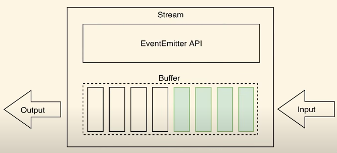

# Parsing Requests:

## Streams:
* A stream is **like a pipe** that lets data flow **piece by piece**.
* **instead of loading everything at once**.
* This makes it **faster** and **uses less memory**, especially for big files or live data.


## Duplex Stream:


## Single Stream vs Duplex Stream:

### Single Stream:
* One-way data flow.
* Either Readable (only read) or Writable (only write).

Example:
* fs.createReadStream() → read-only
* fs.createWriteStream() → write-only

### Duplex Stream:
* Two-way data flow at the same time.
* Can read and write independently.

Example:
* TCP socket (net.Socket) → reads and writes data simultaneously.
* WebSocket connections.


## ✅ What is a Chunk?
* A chunk is a **small piece of data** that a stream sends or receives.
* Instead of handling the whole file or data at once, **Node.js breaks it into chunks for efficiency**.

Example:
When reading a 1GB file:
* Without streams → load full 1GB into memory (slow, heavy).
* With streams → read small chunks (e.g., 64KB) at a time.

### Chunks 1:


### Chunks 2:


## Buffer:
* A Buffer is a **temporary memory area** that **stores binary data** (raw bytes) while it’s being moved between places, like from a file to memory or over the network.

* Because JavaScript normally handles strings and text, but files, images, videos are binary (0s and 1s). Buffers help Node.js work with that binary data.

Example (in simple words): 
* When you stream a video, data comes in chunks. These chunks are kept in a Buffer until the app processes them.
* **Stream** => A **box** to **temporarily hold those pieces** (in binary form).




## Reading Chunk:
```js
req.on('data', chunk => {
    console.log(chunk);
})
```

## Reading and End Reading Chunk:
```js
let chunkArray = [];  //array for holding chunk
//Reading chunk
req.on('data', chunk => {
    chunkArray.push(chunk);
});

//chunk buffering and converting into string
req.on('end', () => {
    const parsedBody = Buffer.concat(chunkArray).toString();
    console.log(parsedBody);
});
```