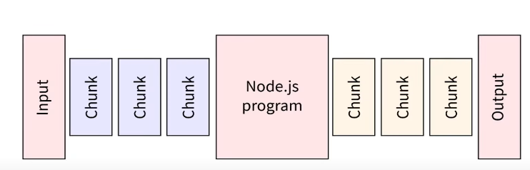

# Parsing Requests:

## Streams:
* A stream is **like a pipe** that lets data flow **piece by piece**.
* **instead of loading everything at once**.
* This makes it **faster** and **uses less memory**, especially for big files or live data.


## Duplex Stream:


## Single Stream vs Duplex Stream:

### Single Stream:
* One-way data flow.
* Either Readable (only read) or Writable (only write).

Example:
* fs.createReadStream() → read-only
* fs.createWriteStream() → write-only

### Duplex Stream:
* Two-way data flow at the same time.
* Can read and write independently.

Example:
* TCP socket (net.Socket) → reads and writes data simultaneously.
* WebSocket connections.


## ✅ What is a Chunk?
* A chunk is a **small piece of data** that a stream sends or receives.
* Instead of handling the whole file or data at once, **Node.js breaks it into chunks for efficiency**.

Example:
When reading a 1GB file:
* Without streams → load full 1GB into memory (slow, heavy).
* With streams → read small chunks (e.g., 64KB) at a time.

### Chunks 1:


### Chunks 2:


## Buffer:
* A Buffer is a **temporary memory area** that **stores binary data** (raw bytes) while it’s being moved between places, like from a file to memory or over the network.

* Because JavaScript normally handles strings and text, but files, images, videos are binary (0s and 1s). Buffers help Node.js work with that binary data.

Example (in simple words): 
* When you stream a video, data comes in chunks. These chunks are kept in a Buffer until the app processes them.
* **Stream** => A **box** to **temporarily hold those pieces** (in binary form).


## Reading Chunk:
```js
req.on('data', chunk => {
    console.log(chunk);
})
```


## Reading and End Reading Chunk:
```js
let chunkArray = [];  //array for holding chunk
//Reading chunk
req.on('data', chunk => {
    chunkArray.push(chunk);
});

//chunk buffering and converting into string
req.on('end', () => {
    const parsedBody = Buffer.concat(chunkArray).toString();
    console.log(parsedBody);
});
```


## Parsing Request:
```js
//1st WAY:
const params = new URLSearchParams(parsedBody);
for(const [key, value] of params.entries()) {
    bodyObject[key] = value;
}

//2nd WAY:
const params = new URLSearchParams(parsedBody);
const bodyObject = Object.fromEntries(params);
console.log(bodyObject);

//writting into file:
fs.writeFile('file_Name', JSON.stringify(bodyObject), (err) => {
    if(err) console.log("Error occur: ", err);
    else console.log("DONE!");
});
```

example:
```js
let chunkArray = [];  //empty array
//Reading chunks
req.on('data', chunk => {
    console.log(chunk);
    chunkArray.push(chunk);
});

//chunk buffering and converting into string
req.on('end', () => {
    const parsedBody = Buffer.concat(chunkArray).toString();
    console.log(parsedBody);

    //1st WAY:
    /*parsedBody is like a URL then we passing into JS in-built function called "URLSearchParams" and applying for-of loop and storing values into emmptyObject called "bodyObject"*/
    // const bodyObject = {};
    const params = new URLSearchParams(parsedBody);
    // for(const [key, value] of params.entries()) {
    //     bodyObject[key] = value;
    // }
    // console.log(bodyObject);

    //2nd WAY:
    const bodyObject = Object.fromEntries(params);
    console.log(bodyObject);

});
```


## Using Modules:
* JavaScript modules allow us to **split code into separate files** and **reuse it easily**.

NOTE: Node.js does **support export default**, **but only in ES Module** (ESM) mode — **not in CommonJS**.

Syntax:
```js
//exporting (single module):
module.exports = object_name;

//importing (single module):
const variable_name = require('object_relative_path');


//exporting (multiple properties/objects):
//1st WAY:
module.exports.property_or_method_name1 = property_or_method_name1;
module.exports.property_or_method_name2 = property_or_method_name2;
module.exports.property_or_method_name3 = property_or_method_name3;

//2nd WAY:
exports.property_or_method_name1 = property_or_method_name1;
exports.property_or_method_name2 = property_or_method_name2;
exports.property_or_method_name3 = property_or_method_name3;


//importing (multiple properties/objects):
const { property_or_method_name1, property_or_method_name2, property_or_method_name3 } = require('relative_path');
```