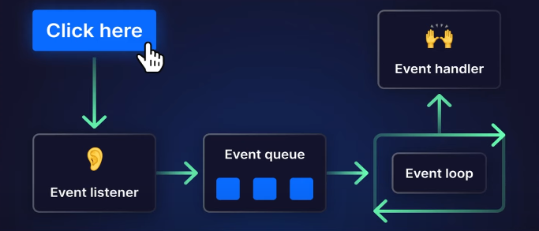
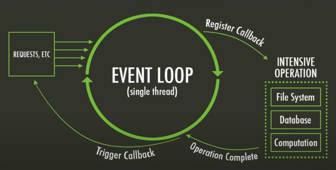
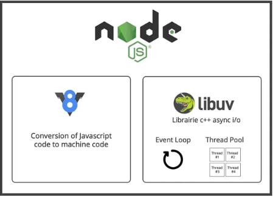
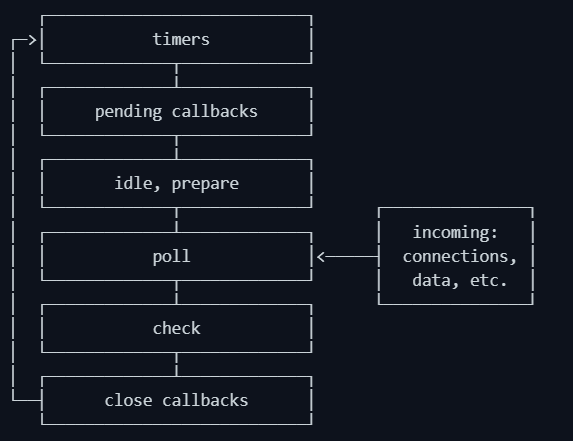

## Event Driven:



1. User Action (Click Here):
    * A user performs an action (e.g., clicking a button or sending a request).
    * This action triggers an event in Node.js.

2. Event Listener:
    * Node.js uses the EventEmitter module, where an event listener is set up to listen for specific events (like click, data, request, etc.).
    * Example:
        ```js
        button.on('click', () => {
        console.log('Button clicked!');
        });
        ```

3. Event Queue (Callback Queue):
    * When the event occurs, the callback (associated function) does not run immediately.
    * Instead, the event is placed into the event queue (also known as the callback queue).
    * This queue holds all callbacks waiting to be processed.

4. Event Loop:
    * The event loop continuously checks if the call stack is empty and if there are any pending events in the event queue.
    * If the call stack is free, the event loop moves the callback from the event queue to the call stack for execution.

5. Event Handler (Callback Execution):
    * The event handler (callback function) is executed.
    * For example, if a button was clicked, the function linked to that click event will now run.


## Single Thread:



1. Requests Enter Node.js:
    * Incoming requests or tasks (e.g., HTTP requests, timers, or I/O operations) are received by Node.js.
    * Node.js is single-threaded, but it can handle multiple tasks using asynchronous operations.

2. Event Loop Starts (Single Thread):
    * The event loop constantly runs in a loop, checking for new tasks and callbacks that need to be executed.

3. Register Callback:
    * When an intensive operation (e.g., reading a file, accessing a database, or performing heavy computations) is requested:
        * Node.js registers a callback function for this task.
        * The heavy work is delegated to Node.js worker threads (through libuv).

4. Intensive Operation (Async Tasks):
    * These tasks are handled in the background (e.g., file system operations, network requests, or database queries).
    * The main thread is not blocked during this time.

5. Operation Complete:
    * When the background task finishes, it signals the event loop that it’s done.

6. Trigger Callback:
    * The callback function (that was registered earlier) is placed in the event queue.
    * The event loop picks it up when the call stack is empty and executes it.


### Single Threaded (Key Points):
* Event loop is the core mechanism that allows Node.js to perform non-blocking I/O.
* Heavy tasks (I/O or DB queries) are sent to worker threads (via libuv), not executed directly in the main thread.
* Callbacks are executed only when the main call stack is clear.
* Node.js remains fast because it never waits for operations—it delegates and continues.


## V8 vs libuv:

V8 engine:
1. **Open-Source**: JavaScript engine by Google.
2. Used in **Chrome** and **Node.js**.
3. **Compiles JavaScript** to **native machine code**.
4. Ensures **high-performance** JavaScript execution.

libuv:
1. **Multi-platform support library** for Node.js.
2. Handles **asynchronous I/O Operations**.
3. **Handles event-driven architecture**.
4. Manages **file system**, **networking**, and **timers non-blockingly** **across platforms**.




## Event Loop Priority:



* **Timers**: This phase executes callbacks scheduled by **setTimeout()** and **setInterval()**.
* **Pending Callbacks**: Executes I/O callbacks deferred to the next loop iteration.
* **Idle**, **Prepare**: Only used internally
* **Poll**: Retrieve **new I/O events**; executes I/O related callbacks (almost all with the exception of close callbacks, the ones scheduled by times and setImmediate()); node will block here when appropriate.
* **Check**: **setImmediate()** callbacks are invoked here.
* **Close Callbacks**: some close callbacks e.g., socket.on('close', ...).

[Click here! for better Understandings](https://youtu.be/Pk9J0SvNXUs?t=1016)


## Async Code:

* Asynchronous code allows certain tasks (like fetching data) to run in the background without blocking the main thread.

Examples of Async Operations:
* Network requests (e.g., fetch())
* Reading files (in Node.js)
* Timers (setTimeout, setInterval)
* Database queries
* Event listeners (e.g., click events)


## Blocking Code:

* Blocking code stops the execution of other code until the current task is completed.
* Node.js is single-threaded, so if a task takes too long (like file reading), it will block the entire event loop, delaying other tasks.
* **Example of blocking code**: Using fs.readFileSync() to read a large file — **nothing else will run until the file is fully read**.

### writeFileSynce (Blocking):

* **fs.writeFileSync()** is the synchronous (blocking) version of writing data to a file.
* It halts the execution of further code until the writing is done.

Example:
```js
const fs = require('fs');

console.log('Start');
fs.writeFileSync('example.txt', 'Hello, blocking world!');
console.log('End');

// Output:
// Start
// End (only after the file is written)
```

### writeFile (Non-Blocking / Async):
* **fs.writeFile()** is asynchronous (non-blocking).
* It writes data to a file and executes a callback once done, allowing other code to run in the meantime.

Example:
```js
const fs = require('fs');

console.log('Start');
fs.writeFile('example.txt', 'Hello, non-blocking world!', (err) => {
    if (err) throw err;
    console.log('File written!');
});
console.log('End');

// Output:
// Start
// End
// File written! (printed last after the file is written)
```