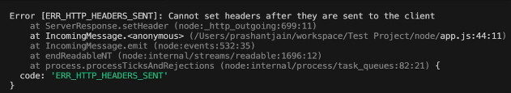

# Types of Errors
1. Syntax Error:
* An error in the **code's structure**, causing it to **not compile** or **run** (*e.g.,* missing semicolon).

2. Logical Error:
* The **code** runs but **produces incorrect results** due to **faulty logic** (*e.g.,* wrong formula).

3. Runtime Error:
* An error that occur **while the program is running**, often **due to invalid operations**.


## Syntax Error:

```js
//Missing paranthesis in function call
console.log("Hello world";

//Unclosed string literal
let message = "Welcome to Node.js;

//Improper use of reserved keywords
let new = 5;

//Incorrect variable declaration (const needs an initial value)
const myVar;
```


## Runtime Errors:

#### Examples:

* Cannot set Headers after they are sent to the client.


```js
//Reference Error (x is not defined)
console.log(x);

//Type Error (num is not a function)
let num = 10;
num();

//Invalid JSON parse (Syntax Error)
let jsonString = "{ name: 'Arbaz' }"  // Invalid JSON (single quotes)
JSON.parse(jsonString);

//File not found error (fs module)
const fs = require('fs');
fs.readFileSync('non_existed_file.txt');  // Throws Error: EN0ENT (file not found) 
```

