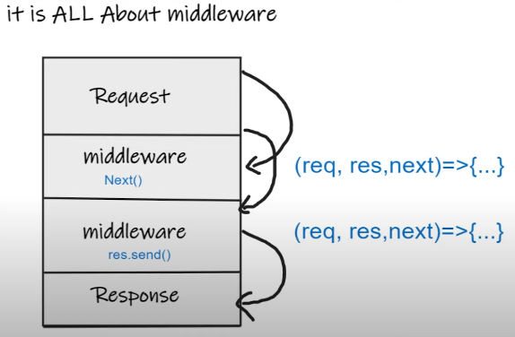
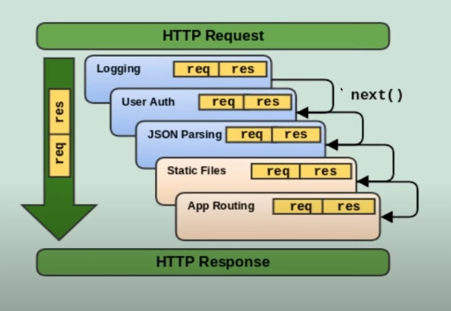

# Express.js

## What is Express.js ?

1. Express.js is a minimal and flexible **web application framework for Node.js**.
2. It provides a robust set of **features for building single-page**, **multi-page**, and **hybrid** web applications.
3. Express.js **simplifies server-side coding** by providing a **layer of fundamentals web application features**.


## Need of Express.js:

1. **Express.js Simplifies Server Creation**: Helps in **quickly setting** up and **running a web server without the need for complex coding**.
2. **Routing Management**: Provides a **powerful routing machanism** to **handle URLs** and **HTTP methods** effectively.
3. **Middleware Support**: Allows the use of **middleware to handle requests**, **response**, and **any middle operations**, making **code modular** and **maintainable**.
4. **API Development**: Facilitates **easy and efficient creation of RESTful APIs**.
5. **Community and Plugins**: Has a **large ecosystem** with **numerous plugins** and **extensions**, **accelerating development time**.


## Installation of Express.js:
 
```bash
npm install express
```

OR 

To Install Express temporarily and not add it to the dependencies list:
```bash
npm install express --no-save
```


## Middleware:
* In Express.js, middleware is a **function** that has **access to the request** (req), **response** (res), and the **next middleware** in the cycle.

* It is used to **modify requests** and **responses**, **execute any code**, **end the request-response cycle**, or **call the next middleware** in the stack.



### Example:



## What is **next** in Express.js?
* In Express.js middleware, **next is a function** that tells Express to move to the **next middleware** or **route handler** in the stack.


## Creating Server with Express.js:

```js
const express = require('express');

const app = express();

app.use((req, res, next) => {
    console.log("First middleware", req.url, req.method);

    //sending html
    res.send(`
        <html>
            <head><title>Express Introduction</title></head>
            <body>
                <h1>Hello world</h1>
            </body>
        </html>    
    `);
});

//server creation
const PORT = 3000;
app.listen(PORT, () => {
    console.log(`Server is running on http://localhost:${PORT}`);
});
```


# Handling Routers:

### Keypoints:
* **Order matters**,
* **"/"** matches everything,
* Can **not call next after res.send()**,
* Calling **res.send** **implicitly calls res.end()**


Syntax:
```js
app.use([path], callback [, callback...]);
```

#### Example:
```js
const express = require('express');
const app = express();

//first middleware
app.use('/', (req, res, next) => {
    console.log(`method: ${req.method} and url: ${req.url}`)
    next();
});

//second middleware
app.use('/submit-details', (req, res, next) => {
    console.log(`submit-details page`);
    res.send(`
        <html>
            <head><title>Express Introduction</title></head>
            <body>
                <h1>This is submit-details page.</h1>
            </body>
        </html>    
    `);
})


app.listen(3000, () => {
    console.log(`Server is running on http://localhost:3000`);
});
```